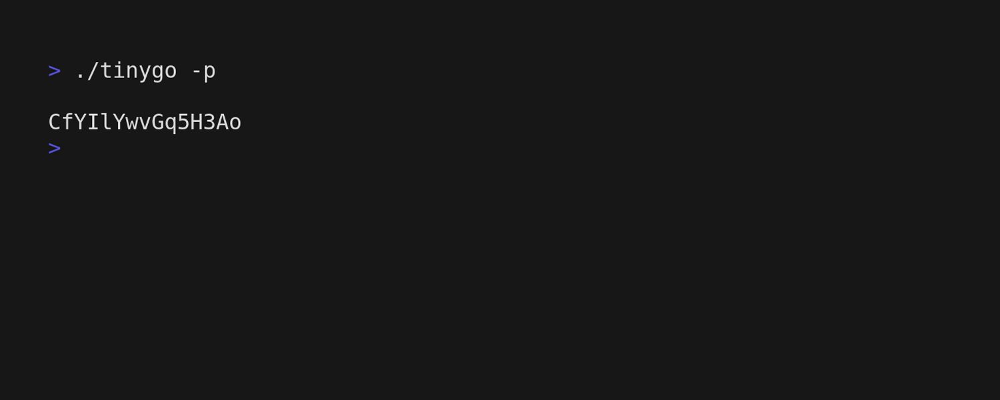

# TinyGo

[](https://pkg.go.dev/github.com/musaubrian/tinygo)

 > A cli tool to help manage your passwords

It is a **Go** version of [tinyDb](https://github.com/musaubrian/tinydb)

Decided to re-write it in Go to learn how to work with
and i actually used a db(**sqlite**) instead of a json file.

## Installation


> **Building from source is \*always better**


If you have go installed simply run
```sh 
go install github.com/musaubrian/tinygo@latest
```
or

```sh
git clone https://github.com/musuabrian/tinygo
cd tinygo
go build .
```

## Usage


## Contributions are welcomed

> ## Find the docs [here](./docs/docs.md)
